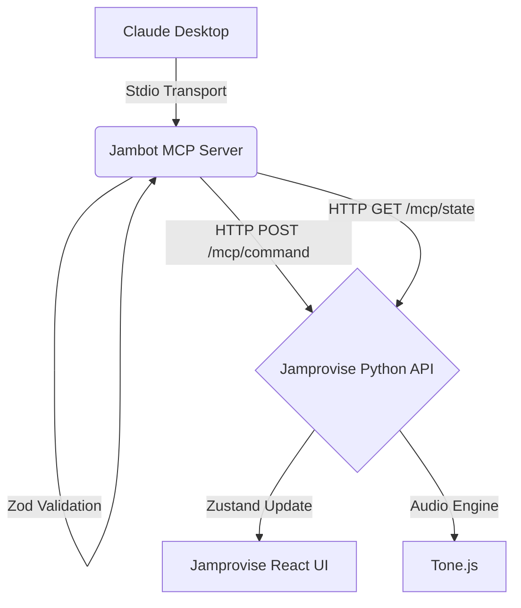

# Jambot MCP Server

> A type-safe Model Context Protocol (MCP) server that provides Large Language Models (LLMs) with domain-constrained, side-effect-safe control over the Jamprovise music synthesis engine.

[](https://npmjs.org/package/@damsarabi/jambot-mcp)
[](https://github.com/damsarabi/jambot-mcp/actions)
[](https://opensource.org/licenses/MIT)

## Overview

Jambot MCP is the orchestration layer that bridges conversational AI with real-time music generation. It extracts complex intent routing and state mutation logic into a standalone, verifiable protocol boundary. 

Instead of relying on fragile prompt engineering to output raw JSON, this server uses **Zod v4** to enforce strict musical constraints (e.g., chord duration limits, flat-to-sharp enharmonic normalization, track availability) *before* the command ever reaches the Jamprovise backend. If an LLM hallucinates an invalid chord quality or exceeds global bar limits, the MCP server rejects it immediately with a typed error, allowing the model to self-correct in a tight feedback loop.

### Why this exists

This repository extracts the orchestration layer of Jamprovise into an independent, open standard. By decoupling the AI control plane from the core application, we achieve:
1. **Agentic Control Boundaries**: Safely exposing complex domain logic to LLMs using the Model Context Protocol (MCP), ensuring strict separation of concerns.
2. **Deterministic Fallbacks**: Using Zod to enforce schema adherence at the protocol boundary, eliminating the need for legacy string-repair heuristics.
3. **Context Hydration via Resources**: Dynamically supplying the LLM with read-only state (e.g., available instruments, style presets) to reduce context window bloat and eliminate hallucinations.

---

## 🛠️ Tools (State Mutators)

The server exposes four tools that Claude (or any MCP client) can use to manipulate the Jamprovise environment:

- **`play_sequence`**: The core creative engine. Generates and plays a new chord sequence. Enforces a strict `MAX_GLOBAL_BARS` limit and validates musical sections.
- **`modify_transport`**: Adjusts tempo, key signature, and playback state. Includes **Pro-tier gating** (e.g., Drone Mode requires `JAMPROVISE_IS_PRO=true`).
- **`query_state`**: Reads a specific field from the live app state using dot-notation (e.g., `tracks.harmony.instrument`).
- **`get_available_instruments`**: Resolves aliases (e.g., "piano" → "harmony") and returns the valid instrument manifest for a given track.

## 📚 Resources (Read-Only Context)

Resources provide the LLM with the context it needs to construct valid tool calls:

- **`jamprovise://styles`**: The current manifest of available musical style presets (e.g., Jazz, Cinematic, Bossa Nova).
- **`jamprovise://instruments`**: The valid instrument names categorized by track (Harmony, Bass, Percussion).
- **`jamprovise://schema`**: The full domain constraints (voicing indexes, enharmonic rules) provided as markdown.

---

## 🚀 Installation & Usage with Claude Desktop

To use this server with Claude Desktop, you need a running instance of the Jamprovise backend (or you can point it to production if you have an API key).

### Option 1: Run directly via NPX (Recommended)
You can run the published NPM package directly without cloning the repository. Add the following to your Claude Desktop configuration file:

- **Mac**: `~/Library/Application Support/Claude/claude_desktop_config.json`
- **Windows**: `%APPDATA%\Claude\claude_desktop_config.json`

```json
{
  "mcpServers": {
    "jambot": {
      "command": "npx",
      "args": [
        "-y",
        "@damsarabi/jambot-mcp"
      ],
      "env": {
        "JAMPROVISE_API_URL": "http://localhost:8000",
        "JAMPROVISE_API_KEY": "your-dev-api-key",
        "JAMPROVISE_IS_PRO": "true"
      }
    }
  }
}
```

### Option 2: Build from Source
If you want to modify the server or run it locally from source:

1. Clone and build the project:
   ```bash
   git clone https://github.com/damsarabi/jambot-mcp.git
   cd jambot-mcp
   npm install
   npm run build
   ```

2. Update your Claude Desktop config to point to the local build:
```json
{
  "mcpServers": {
    "jambot": {
      "command": "node",
      "args": [
        "/absolute/path/to/jambot-mcp/dist/index.js"
      ],
      "env": {
        "JAMPROVISE_API_URL": "http://localhost:8000",
        "JAMPROVISE_API_KEY": "your-dev-api-key",
        "JAMPROVISE_IS_PRO": "true"
      }
    }
  }
}
```

3. Restart Claude Desktop. You will now see the tools are available.

## 🎥 Demo

*[Loom Video Placeholder: Insert a 2-minute demo showing Claude Desktop communicating with the local Jamprovise UI via the MCP Stdio transport]*

## Architecture



## License
MIT
